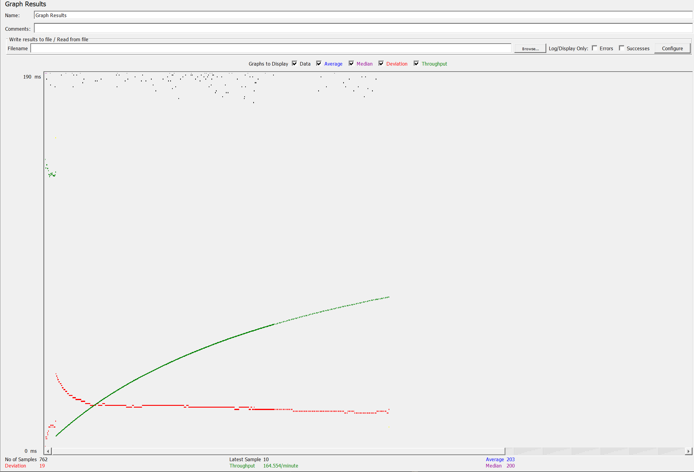
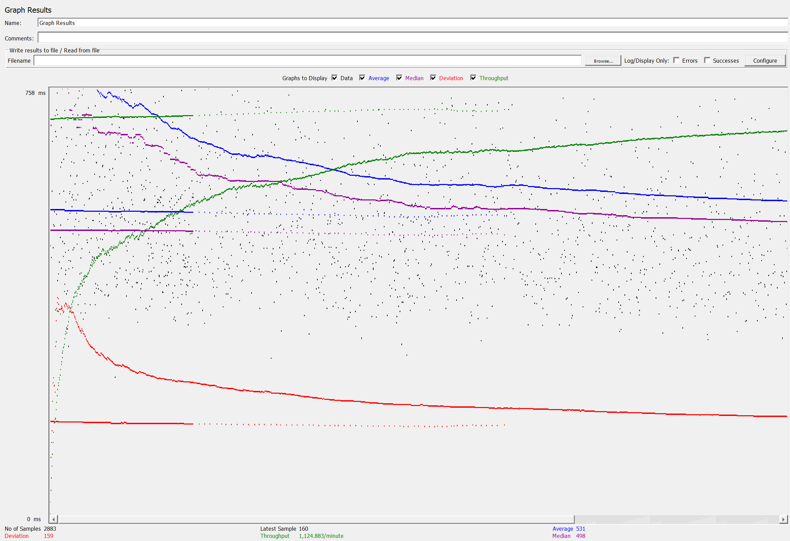
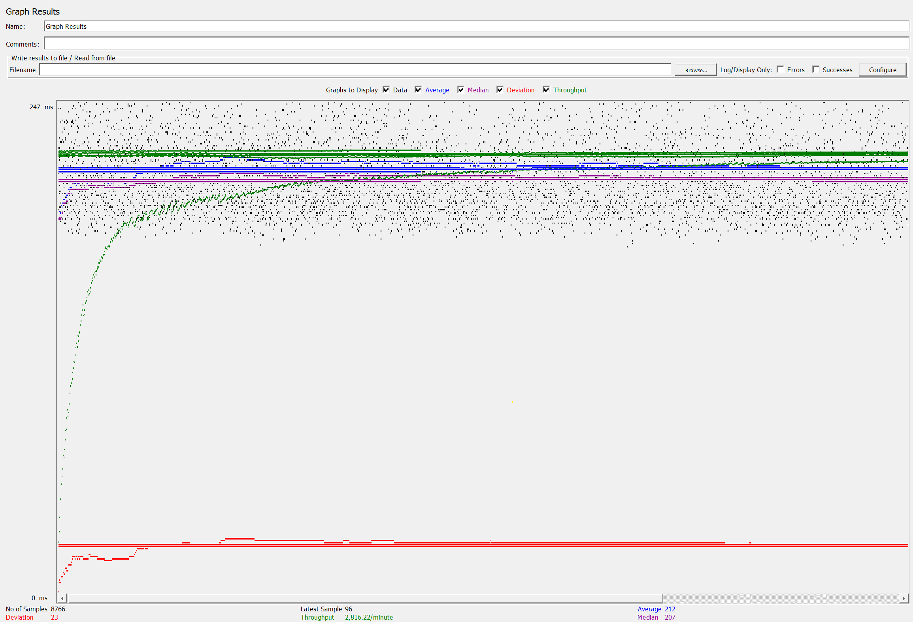
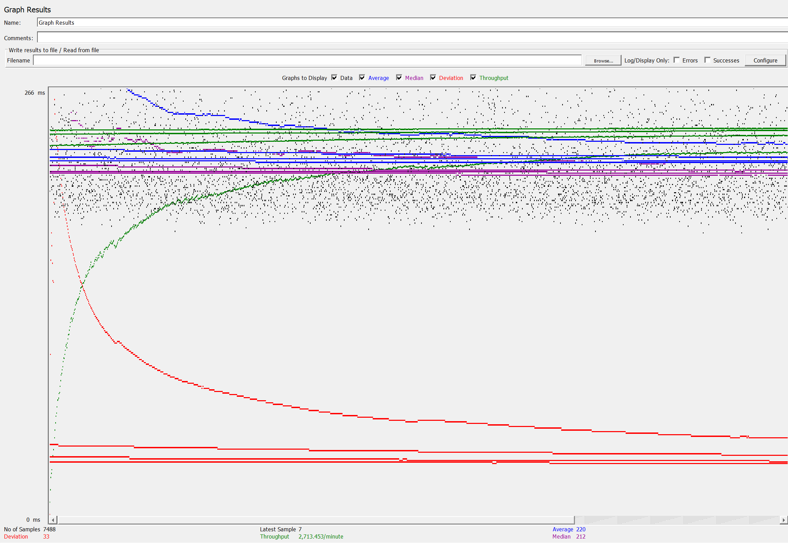

- # Connection Pooling
    - #### Include the filename/path of all code/configuration files in GitHub of using JDBC Connection Pooling.
        - [context.xml](../WebContent/META-INF/context.xml),
          [web.xml](../WebContent/WEB-INF/web.xml),
          [AddMovieServlet.java](../src/AddMovieServlet.java), 
          [AddStarServlet.java](../src/AddStarServlet.java), 
          [BrowseGenreServlet.java](../src/BrowseGenreServlet.java), 
          [EmployeeMetaDataServlet.java](../src/EmployeeMetaDataServlet.java), 
          [LoginEmployeeServlet.java](../src/LoginEmployeeServlet.java),
          [LoginServlet.java](../src/LoginServlet.java)
          [MovieListServlet.java](../src/MovieListServlet.java)
          [MovieSuggestionServlet.java](../src/MovieSuggestionServlet.java)
          [PaymentPageServlet.java](../src/PaymentPageServlet.java)
          [PurchaseConfirmServlet.java](../src/PurchaseConfirmServlet.java)
          [ShoppingCartServlet.java](../src/ShoppingCartServlet.java)
          [SingleMovieServlet.java](../src/SingleMovieServlet.java)
          [SingleStarServlet.java](../src/SingleStarServlet.java)
    - #### Explain how Connection Pooling is utilized in the Fabflix code.
        - In [context.xml](../WebContent/META-INF/context.xml), two data sources are defined with Tomcat pooling enabled
            using the `factory`, `maxTotal`, `maxIdle`, and `maxWaitMillis` tags
        - For each of the Java Servlets that need to talk to the database, instead of using DriverManager to talk to the 
            database which open and close a connection for every query, it uses DataSource which open a pool of 
            connections to the database so that each request can take a connection from the pool, run the query, and
            return the connection back to the pool
    - #### Explain how Connection Pooling works with two backend SQL.
        - Having two backend SQL or other different numbers of backend SQL doesn't affect how Connection Pooling work.
            For each data source defined as a certain SQL database instance, if Connection Pooling is enable, Tomcat will create a pool
            of open connections between the web server and that database instance. Anytime a query is executed, Tomcat 
            will take a connection from the pool, run the query using that connection, and return the connection back to
            the pool. This method eliminates the overhead of opening and closing connections from running queries.

- # Master/Slave
    - #### Include the filename/path of all code/configuration files in GitHub of routing queries to Master/Slave SQL.
        - Routed to master: 
          [AddMovieServlet.java](../src/AddMovieServlet.java),
          [AddStarServlet.java](../src/AddStarServlet.java),
          [PaymentPageServlet.java](../src/PaymentPageServlet.java)
        - Routed to the local MySQL database instance:
          [AddMovieServlet.java](../src/AddMovieServlet.java),
          [BrowseGenreServlet.java](../src/BrowseGenreServlet.java),
          [EmployeeMetaDataServlet.java](../src/EmployeeMetaDataServlet.java),
          [LoginEmployeeServlet.java](../src/LoginEmployeeServlet.java),
          [LoginServlet.java](../src/LoginServlet.java)
          [MovieListServlet.java](../src/MovieListServlet.java)
          [MovieSuggestionServlet.java](../src/MovieSuggestionServlet.java)
          [PaymentPageServlet.java](../src/PaymentPageServlet.java)
          [PurchaseConfirmServlet.java](../src/PurchaseConfirmServlet.java)
          [ShoppingCartServlet.java](../src/ShoppingCartServlet.java)
          [SingleMovieServlet.java](../src/SingleMovieServlet.java)
          [SingleStarServlet.java](../src/SingleStarServlet.java)
    - #### How read/write requests were routed to Master/Slave SQL?
        - For servlets that serve read requests, each has a DataSource object that connects to the MySQL instance in its 
          own AWS server instance, no matter if the MySQL instance is master or slave. 
        - For servlets that serve write requests, each has a DataSource object that connects to master MySQL instance.
        - For servlets that serve both types of requests, each has both types of DataSource object.

- # JMeter TS/TJ Time Logs
    - #### Instructions of how to use the `log_processing.*` script to process the JMeter logs.
        - ```
          sudo su
          cd /var/lib/tomcat10/webapps/s23-122b-web_dev
          cp timelog /home/ubuntu/s23-122b-web_dev/
          exit
          cd s23-122b-web_dev
          sudo python3 log_processing.py timelog
          ```

- # JMeter TS/TJ Time Measurement Report

| **Single-instance Version Test Plan**          | **Graph Results Screenshot**                         | **Average Query Time(ms)** | **Average Search Servlet Time(ms)** | **Average JDBC Time(ms)** | **Analysis**                                                                                                                                                                                                                                       |
|------------------------------------------------|------------------------------------------------------|----------------------------|-------------------------------------|---------------------------|----------------------------------------------------------------------------------------------------------------------------------------------------------------------------------------------------------------------------------------------------|
| Case 1: HTTP/1 thread                          |      | 206                        | 48                                  | 46                        | With a single thread, its clear that it is much faster. This is because we are dealing with one consecutive request which is significantly less workload than in multithreaded cases.                                                              |
| Case 2: HTTP/10 threads                        |    | 480                        | 234                                 | 233                       | We can see that the execution rate is slower with 10 threads because of the additional workload serving multiple session onto a single server.                                                                                                     |
| Case 3: HTTPS/10 threads                       |   | 528                        | 367                                 | 363                       | With https requests, we can see how the additional security measures (encryption - decryption) add to the load required to process a request. This is is more expensive and we get a performance drop even compared to without connection pooling. |
| Case 4: HTTP/10 threads/No connection pooling  |  | 509                        | 345                                 | 331                       | We can see that when disabling connection pooling we get worse performance due to the lack of reusing connections. By disabling such a feature, we are making a new connection each request which is costly.                                       |

| **Scaled Version Test Plan**                   | **Graph Results Screenshot**                   | **Average Query Time(ms)** | **Average Search Servlet Time(ms)** | **Average JDBC Time(ms)** | **Analysis**                                                                                                                                                                                                                                                                                       |
|------------------------------------------------|------------------------------------------------|----------------------------|-------------------------------------|---------------------------|----------------------------------------------------------------------------------------------------------------------------------------------------------------------------------------------------------------------------------------------------------------------------------------------------|
| Case 1: HTTP/1 thread                          |           | 207                        | 48                                  | 46                        | Despite the load balancer we are getting mostly the same numbers. This is because it is single threaded thus the distribution of tasks are diverted to the same session which is roughly equivalent  to what we have in the previous case.                                                         |
| Case 2: HTTP/10 threads                        |  | 283                        | 108                                 | 107                       | Here we can see a dramatic difference in performance with the scaled version. This is because with a load balancer, we distribute across requests to master/slave evenly as well as route backend sql servers requests to each respective server. This reduces the overall burden for each server. |
| Case 3: HTTP/10 threads/No connection pooling  |          | 306                        | 142                                 | 137                       | Here we have a noticeable drop off in performance because we no longer pool the connections. Therefore, a new connection winds up being made by each request which dampens the performance compared to pooling.                                                                                    |